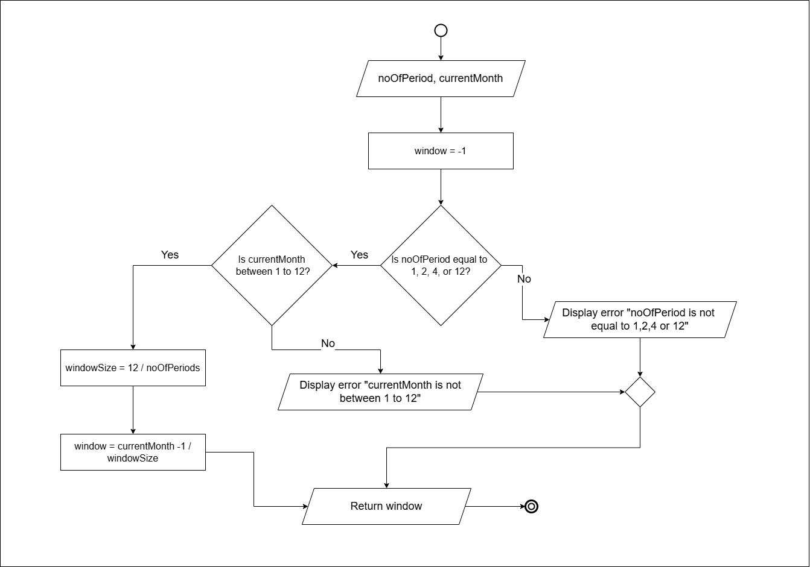

# Software Developer Fitness Test - Question 3

## Deliverables

- Flowchart
- Pseudocode with test data
- JavaScript Implementation
- Test Results for all scenarios

---

## Question


---

## Repository Information

### GitHub Repository

The complete source code for this solution is available at:

**https://github.com/sim33-k/CL-3**

### Project Structure

```
CL-3/
|-- doc/
|   |-- FlowChart.drawio
|   |-- FlowChart.drawio.png
|-- images/
|   |-- question3.png
|   |-- test1.png
|   |-- test2.png
|   |-- test3.png
|   |-- test4.png
|-- pseudocode/
|   |-- pseudocode.txt
|-- src/
|   |-- solution.js
|-- tests/
|   |-- test.js
|-- README.md
```

**Directory Descriptions:**

- `doc/` - Contains the flowchart diagram files
- `images/` - Contains the question image and test images
- `pseudocode/` - Contains the algorithm pseudocode
- `src/` - Contains the JavaScript implementation
- `tests/` - Contains test files for all scenarios

The test.js includes the code snippet provided in the question for testing all the 4 scenarios.

### How to Run

**Prerequisites:**
- Node.js installed on your system

**Steps to run the tests:**

```bash
# Clone the repository
git clone https://github.com/sim33-k/CL-3.git
cd CL-3

# Run the test file
cd ../tests
node test.js
```

---

## Flowchart



*Flowchart showing the algorithm logic*

---

## Pseudocode

```
begin
    input currentMonth, noOfPeriods

    // current month validation
    if currentMonth >= 1 and currentMonth <= 12 then
        // number of periods validation
        if noOfPeriods == 1 or noOfPeriods == 2 or 
           noOfPeriods == 4 or noOfPeriods == 12 then

            // window size
            windowSize = 12 / noOfPeriods

            // window
            window = (currentMonth - 1) / windowSize

            display window
        
        else
            display "Number of periods must be either 1, 2, 4 or 12"
            
        endif
        
    else 
        display "Current Month should be between 1 and 12"

    endif

end
```

---

## JavaScript Implementation

```javascript
function getWindowIdx(noOfPeriods, currentMonth)
{
    const validPeriods = [1,2,4,12];
    const months = 12;
    let window = -1;

    try {
        
        // validate current month
        if(currentMonth > 12 || currentMonth < 1) {
            throw new Error("The current month should be between 1 and 12");
        }

        // validate number of periods
        if(!validPeriods.includes(noOfPeriods)) {
            throw new Error("Invalid number of periods");
        }

        // window size
        const windowSize = months / noOfPeriods;

        // window index
        window = Math.floor((currentMonth - 1) / windowSize);


    } catch(error) {
        return -1;
    }

    return window;

}
```

---

## Test Results

The following test results were generated using the test code provided in the question paper:

```javascript
for (let m = -5; m <= 15; m++) {
    const noOfPeriods = 4; // possible values: 1, 2, 4, 12
    const currentMonth = m;
    const windowIdx = getWindowIdx(noOfPeriods, currentMonth);
    console.log(`currentMonth=${currentMonth} : noOfPeriods=${noOfPeriods} : window=${windowIdx}`);
}
```

Since the provided code only tested one scenario (noOfPeriods = 4), we modified it to test all four scenarios:

```javascript
for (let period of [1, 2, 4, 12]) {
    const noOfPeriods = period;
    console.log(`---------------noOfPeriods=${noOfPeriods}---------------`);
    for (let m = -5; m <= 15; m++) {
        const currentMonth = m;
        const windowIdx = getWindowIdx(noOfPeriods, currentMonth);
        console.log(`currentMonth=${currentMonth} : noOfPeriods=${noOfPeriods} : window=${windowIdx}`);
    }
}
```

The test was executed for all four scenarios (noOfPeriods = 1, 2, 4, 12) with month values ranging from -5 to 15. The output screenshots below show the results with the `<p>` tags removed for cleaner display.

### Scenario 1: 1 Period


*Test results for 1 period*

### Scenario 2: 2 Periods


*Test results for 2 periods*

### Scenario 3: 4 Periods


*Test results for 4 periods*

### Scenario 4: 12 Periods


*Test results for 12 periods*

---

